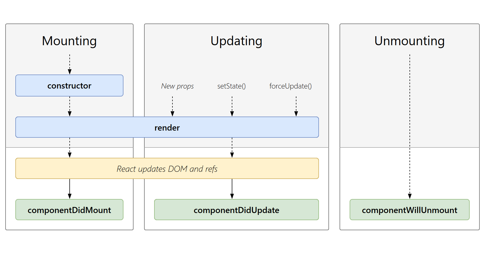

# React学习

## JavaScript语法

```javascript
return {
    ...letter,
    isStarred: !letter.isStarred
};
```
使用了对象展开运算符...letter将原始对象letter的属性复制到一个新对象中。然后，通过给新对象的isStarred属性赋一个相反的值（即取反），实现了对isStarred属性的修改。

## 快速入门
[井字棋](https://react.docschina.org/learn/tutorial-tic-tac-toe)

```JSX
  const [squares, setSquares] = useState(Array(9).fill(null));

  function handleClick(i) {
    const nextSquares = squares.slice();
    nextSquares[i] = 'X';
    setSquares(nextSquares);
  }
  ...
    <Square value={squares[0]} onSquareClick={() => handleClick(0)} />
```

* 在父组件中更新子组件的状态
* 不变性        
    handleClick 中，调用<code>.slice()</code>来创建 squares 数组的副本而不是修改现有数组。

```JSX
<li key={move}>
        <button onClick={() => jumpTo(move)}>{description}</button>
</li>
```
* 元素key属性的作用是用于判断元素是新创建的还是被移动的元素，从而减少不必要的Diff,因此key的值需要为每一个元素赋予一个确定的标识
  
## 状态管理

### 用 State 响应输入

[点击控制<code>.css</code>](App(2).js)

### 选择 State 结构

#### 构建 state 的原则 

1. 合并关联的 state。如果你总是同时更新两个或更多的 state 变量，请考虑将它们合并为一个单独的 state 变量。
```JSX
    const [position, setPosition] = useState({
        x: 0,
        y: 0
    });
```
2. 避免互相矛盾的 state。当 state 结构中存在多个相互矛盾或“不一致”的 state 时，你就可能为此会留下隐患。应尽量避免这种情况。
3. 避免冗余的 state。如果你能在渲染期间从组件的 props 或其现有的 state 变量中计算出一些信息，则不应将这些信息放入该组件的 state 中。
4. 避免重复的 state。当同一数据在多个 state 变量之间或在多个嵌套对象中重复时，这会很难保持它们同步。应尽可能减少重复。
5. 避免深度嵌套的 state。深度分层的 state 更新起来不是很方便。如果可能的话，最好以扁平化方式构建 state。
```JSX
export const initialTravelPlan = {
  0: {
    id: 0,
    title: '(Root)',
    childIds: [1, 42, 46],
  },
  ......
}
......
function PlaceTree({ id, placesById }) {
  const place = placesById[id];
  const childIds = place.childIds;
  return (
    <li>
      {place.title}
      {childIds.length > 0 && (
        <ol>
          {childIds.map(childId => (
            <PlaceTree
              key={childId}
              id={childId}
              placesById={placesById}
            />
          ))}
        </ol>
      )}
    </li>
  );
}
......
```

### 组件的生命周期

* Mounting (挂载)
  当组件实例被创建并插入 DOM 中时，其生命周期调用顺序如下：

  * constructor(): 在 React 组件挂载之前，会调用它的构造函数。
  * getDerivedStateFromProps(): 在调用 render 方法之前调用，并且在初始挂载及后续更新时都会被调用。    
  getDerivedStateFromProps() 方法格式如下：

    static getDerivedStateFromProps(props, state)
    getDerivedStateFromProps 会在调用 render 方法之前调用，即在渲染 DOM 元素之前会调用，并且在初始挂载及后续更新时都会被调用。

    state 的值在任何时候都取决于 props。

    getDerivedStateFromProps 的存在只有一个目的：让组件在 props 变化时更新 state。

    该方法返回一个对象用于更新 state，如果返回 null 则不更新任何内容。

    以下实例 favoritesite 的初始值为 runoob，但是 getDerivedStateFromProps() 方法通过favsite 属性更新了 favoritesite 的值：  
```JSX
class Header extends React.Component {
  constructor(props) {
    super(props);
    this.state = {favoritesite: "runoob"};
  }
  static getDerivedStateFromProps(props, state) {
    return {favoritesite: props.favsite };
  }
  render() {
    return (
      <h1>我喜欢的网站是 {this.state.favoritesite}</h1>
    );
  }
}
 
ReactDOM.render(<Header favsite="Google"/>, document.getElementById('root'));
```
  * render(): render() 方法是 class 组件中唯一必须实现的方法。
  * componentDidMount(): 在组件挂载后（插入 DOM 树中）立即调用。
  
  render() 方法是 class 组件中唯一必须实现的方法，其他方法可以根据自己的需要来实现。
* Updating (更新)

  每当组件的 state 或 props 发生变化时，组件就会更新。

  * getDerivedStateFromProps(): 在调用 render 方法之前调用，并且在初始挂载及后续更新时都会被调用。根据 shouldComponentUpdate() 的返回值，判断 React 组件的输出是否受当前 state 或 props 更改的影响。
  * shouldComponentUpdate():当 props 或 state 发生变化时，shouldComponentUpdate() 会在渲染执行之前被调用。
    * shouldComponentUpdate() 方法会返回一个布尔值，指定 React 是否应该继续渲染，默认值是 true， 即 state 每次发生变化组件都会重新渲染。
  * render(): render() 方法是 class 组件中唯一必须实现的方法。
  * getSnapshotBeforeUpdate(): 在最近一次渲染输出（提交到 DOM 节点）之前调用。
  * componentDidUpdate(): 在更新后会被立即调用。

* Upmountinging (卸载)
  当组件从 DOM 中移除时会调用如下方法：

  * componentWillUnmount(): 在组件卸载及销毁之前直接调用。

  
### createRoot

* createRoot(domNode, options?) 
调用 createRoot 以在浏览器 DOM 元素中创建根节点显示内容。
```JSX
import { createRoot } from 'react-dom/client';

const domNode = document.getElementById('root');
const root = createRoot(domNode);
```
React 将会为 domNode 创建一个根节点，并控制其中的 DOM。在已经创建根节点之后，需要调用 <code>root.render</code> 来显示 React 组件：
```JSX
root.render(<App />);
```
渲染一个完全由React构建的应用
  * 获取 HTML 中定义的DOM 节点
  * 在该 DOM 节点中显示 React 组件
```html
<!DOCTYPE html>
<html>
  <head><title>My app</title></head>
  <body>
    <!-- 这就是我们提到的 DOM 节点 -->
    <div id="root"></div>
  </body>
</html>

```
```js
import { createRoot } from 'react-dom/client';
import App from './App.js';
import './styles.css';

const root = createRoot(document.getElementById('root'));
root.render(<App />);
```
```js
import { useState } from 'react';

export default function App() {
  return (
    <>
      <h1>你好，世界!</h1>
      <Counter />
    </>
  );
}

function Counter() {
  const [count, setCount] = useState(0);
  return (
    <button onClick={() => setCount(count + 1)}>
      点击了 {count} 次
    </button>
  );
}

```